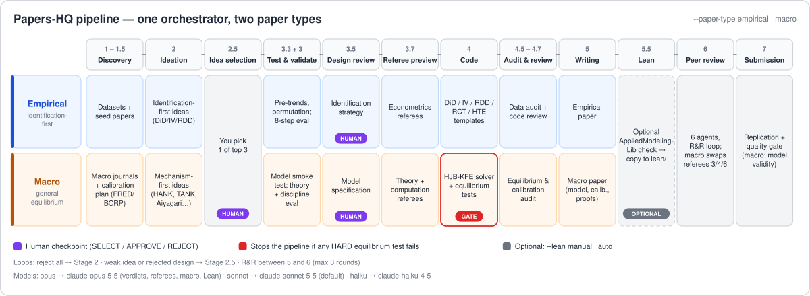
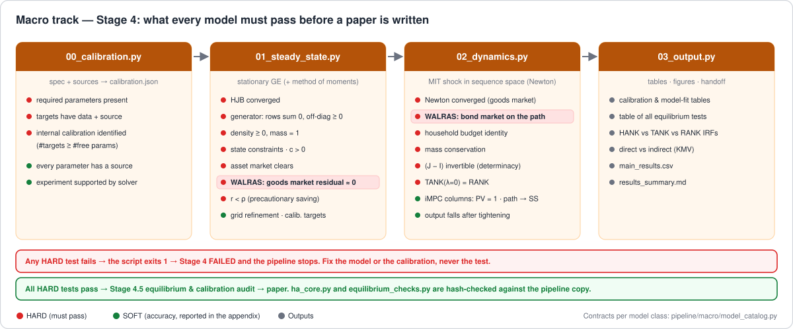

# Papers-HQ: Automated Academic Paper Production Pipeline

[](https://www.python.org/)
[](LICENSE)
[](https://github.com/jnichor/Top_papers_creator)
[](https://github.com/jnichor/Top_papers_creator/stargazers)
[](https://claude.ai/code)
[](https://antigravity.google/)

> **This is a fork of [jnichor/Top_papers_creator](https://github.com/jnichor/Top_papers_creator).** Additions in this fork: full `requirements.txt`, expanded public-data sources (PUCP, CONCYTEC, UP DSpace), corrected installation guide, replication-mode beta label, a **macro track** for general-equilibrium papers (HANK, TANK, Aiyagari, Huggett) with equilibrium tests and journal-targeted literature search, an optional **Lean formalization** stage, and pinned current Claude models.

A hybrid AI-human research pipeline that takes you from a research idea to a submission-ready paper. Claude handles reasoning (ideation, validation, writing, review); Python handles execution (data loading, code generation, statistics, LaTeX compilation). State is persisted between stages so you can stop, resume, or rerun any stage at will.

The pipeline is built on top of the [Claude Code](https://claude.ai/code) CLI and integrates two community skills from [Claes Bäckman](https://claesbackman.com): [`review-paper`](Skills/review-paper.md) (Stage 6 peer review) and [`review-paper-code`](Skills/review-paper-code.md) (Stage 4.7 code review).


## Pipeline at a glance

One orchestrator, two paper types: **empirical** (identification-first: DiD, IV, RDD, RCT, HTE; the default) and **macro** (model-based general equilibrium, `--paper-type macro`). Both run the same stages and checkpoints; the content of each stage changes with the paper type.

<p align="center">
  
</p>

7 core stages plus 2 human checkpoints (and an optional Lean stage):

| Stage | Name | Type | What it does |
|---|---|---|---|
| 1 | Discovery | Auto | Finds datasets and 3 seed papers (Path A: by topic, Path B: from your data) |
| 1.5 | Data Loading | Auto | Downloads and profiles candidate datasets (Path A only) |
| 2 | Ideation | Auto | Generates 8 to 10 research ideas ranked by novelty × feasibility × impact |
| 2.5 | Idea Selection | Human | You pick 1 of the top 3 ideas, or reject all and re-ideate |
| 3 | Validation | Auto | 8-step evaluation collapsed into 4 calls; literature review via Semantic Scholar |
| 3.3 | Quick Empirical Test | Auto | Pre-trends, permutation, magnitude checks; fail-fast before code generation (macro: model smoke test) |
| 3.5 | Strategy Review | Human | You approve the identification strategy or loop back |
| 3.7 | Referee Preview | Auto | Adversarial referee scan for fatal flaws (selection bias, weak instruments) |
| 4 | Strategy & Code | Auto | Strategy memo + numbered Python scripts (load → clean → analyze → output); macro: HJB-KFE solver + equilibrium tests, stops on any HARD failure |
| 4.5 | Data Audit | Auto | Validates reproducibility of intermediate data outputs |
| 4.7 | Code Review | Auto | `review-paper-code` skill + auto-correction loop (max 3 rounds) |
| 5 | Writing | Auto | Drafts LaTeX paper from results; compiles to PDF |
| 5.5 | Lean Formalization | Optional | AppliedModelingLib workflow: paper check, then copy the generated folder to `lean/` exactly as generated (`--lean`) |
| 6 | Peer Review | Auto | `review-paper` skill: 6 parallel agents + R&R loop (max 3 rounds) |
| 7 | Submission | Auto | Replication audit, integration validation, journal targeting |


## Installation

### Prerequisites

- **[Claude Code CLI](https://docs.anthropic.com/en/docs/claude-code)**: every LLM call runs through `claude -p` (headless mode) via subprocess. Install it once and authenticate with any of the options below.

  **Authentication (pick one):**
  | Option | How |
  |---|---|
  | Claude.ai Pro or Max subscription | `claude login` in your terminal |
  | Anthropic API key | `export ANTHROPIC_API_KEY=sk-...` (or set in `.env`) |
  | DeepSeek API (cheaper alternative) | See [DeepSeek backend](#deepseek-backend-optional-experimental-not-fully-tested) below |

  > A Pro subscription is sufficient for most runs. Max gives higher rate limits for long parallel stages (4, 5, 6). Any terminal works (VS Code, Windows Terminal, Google Antigravity, etc.); no special IDE required.

- **Python 3.11+** (tested on 3.14 on Windows)
- **LaTeX** with `pdflatex` on `PATH`: [TeX Live](https://tug.org/texlive/) (Linux/Mac) or [MiKTeX](https://miktex.org/) (Windows)

---

### Step 1: Clone

```bash
git clone https://github.com/jnichor/Top_papers_creator.git
cd Top_papers_creator
```

### Step 2: Create a virtual environment (recommended)

**Using `venv` (built-in):**

```bash
# Windows
python -m venv .venv
.venv\Scripts\activate

# macOS / Linux
python -m venv .venv
source .venv/bin/activate
```

**Using `conda`:**

```bash
conda create -n papers-hq python=3.12
conda activate papers-hq
```

> All subsequent `pip install` commands should run inside the activated environment.

### Step 3: Install dependencies

**Core + econometrics (required for all modes):**

```bash
pip install pandas numpy requests scipy matplotlib scikit-learn statsmodels
pip install linearmodels pyfixest econml doubleml
pip install wildboottest rdrobust rddensity bacondecomp csdid
```

**Peruvian microdata (ENAHO, ENDES, and other INEI surveys):**

```bash
pip install inei-microdatos
```

**PDF handling (Stage 5 writing + Stage 7 audit):**

```bash
pip install pymupdf fpdf2 Pillow
```

Or install everything at once from the lockfile:

```bash
pip install -r requirements.txt
```

**Optional packages** (uncomment in `requirements.txt` to enable):

| Package | Enables |
|---|---|
| `paperdl` | Richer seed-paper search: arXiv, OpenReview, PMLR, PMC |
| `owslib` | INGEMMET GEOCATMIN spatial layers (WFS) |
| `rarfile` | Extract `.rar` replication packages |

```bash
# Install all optional packages
pip install paperdl owslib rarfile
```

### Step 4: Run

Open the project folder in any terminal (VS Code, Windows Terminal, etc.), make sure Claude Code CLI is authenticated, and run:

```bash
python run_pipeline.py --topic "Your research topic"
```

---

### DeepSeek backend (optional) `[experimental, not fully tested]`

> **Warning:** DeepSeek integration has not been tested end-to-end with this pipeline. Multi-turn reasoning, tool use, and parallel agent stages (4, 5, 6) may behave differently from Claude. Use at your own risk and expect edge cases.

Claude Code CLI supports alternative OpenAI-compatible backends via environment variables. To route all pipeline LLM calls through [DeepSeek](https://api-docs.deepseek.com/quick_start/agent_integrations/claude_code) instead of Anthropic:

**Windows (PowerShell):**

```powershell
$env:ANTHROPIC_BASE_URL="https://api.deepseek.com/anthropic"
$env:ANTHROPIC_AUTH_TOKEN="<your DeepSeek API Key>"
$env:ANTHROPIC_MODEL="deepseek-v4-pro[1m]"
$env:ANTHROPIC_DEFAULT_OPUS_MODEL="deepseek-v4-pro[1m]"
$env:ANTHROPIC_DEFAULT_SONNET_MODEL="deepseek-v4-pro[1m]"
$env:ANTHROPIC_DEFAULT_HAIKU_MODEL="deepseek-v4-flash"
$env:CLAUDE_CODE_SUBAGENT_MODEL="deepseek-v4-flash"
$env:CLAUDE_CODE_EFFORT_LEVEL="max"
```

**macOS / Linux (bash):**

```bash
export ANTHROPIC_BASE_URL="https://api.deepseek.com/anthropic"
export ANTHROPIC_AUTH_TOKEN="<your DeepSeek API Key>"
export ANTHROPIC_MODEL="deepseek-v4-pro[1m]"
export ANTHROPIC_DEFAULT_OPUS_MODEL="deepseek-v4-pro[1m]"
export ANTHROPIC_DEFAULT_SONNET_MODEL="deepseek-v4-pro[1m]"
export ANTHROPIC_DEFAULT_HAIKU_MODEL="deepseek-v4-flash"
export CLAUDE_CODE_SUBAGENT_MODEL="deepseek-v4-flash"
export CLAUDE_CODE_EFFORT_LEVEL="max"
```

Then run the pipeline normally; the env vars are picked up automatically by the `claude` subprocess:

```bash
python run_pipeline.py --topic "Your research topic"
```

If Claude Code prompts for permissions on every tool call (common with third-party backends), add `--dangerously-skip-permissions` directly to the `claude -p` invocation inside `pipeline/claude_runner.py`:

```python
# pipeline/claude_runner.py, _build_cmd()
cmd = [claude_executable(), "-p", "--dangerously-skip-permissions", "--output-format", "text"]
```

> **Security note:** `--dangerously-skip-permissions` disables Claude Code's built-in permission prompts for file and shell access. Only add it if you understand what the pipeline executes. Never use it on a machine with unreviewed code or sensitive credentials in scope.

The pipeline also uses these free public APIs (no key needed):

| Source | Used for |
|---|---|
| Harvard Dataverse, Zenodo | Dataset discovery and download |
| datosabiertos.gob.pe | Peruvian government open data |
| INEI microdata portal | ENAHO, ENDES survey download |
| BCRP REST API | Peruvian macro time series |
| World Bank, IDB, FAOSTAT | Cross-country panel data |
| Socrata (~30 US city/state portals) | Municipal open data |
| Semantic Scholar | Literature review |
| PUCP, CONCYTEC repositories | Peruvian academic papers (seed papers) |
| ALICIA (CONCYTEC) | Peruvian open-access papers |
| GitHub | Replication packages |


## Usage

### Start a new project

```text
# Path A: Discover datasets by topic
python run_pipeline.py --topic "Digital Wallets in Peru"

# Path B: Bring your own dataset
python run_pipeline.py --topic "Labor Markets" --data "./panel.csv"

# Path C: Data-first (find the best public datasets, then suggest topics)
python run_pipeline.py --path-c

# Path C smoke: local microdata, no APIs/Claude/input; stops after Stage 1
python run_pipeline.py --path-c --smoke --to-stage 1 --project path_c_smoke
```

### Replication mode (student assignment / HTE extension) `[beta]`

> **Beta:** replication mode is functional but still under active development. Paper candidate ranking, HTE template generation, and public-data verification work end-to-end; edge cases and some journal-specific replication packages may require manual adjustment.

Replicate an existing paper and add a heterogeneous treatment effects extension.

```text
# Search by topic: pipeline finds and ranks replication candidates
python run_pipeline.py --topic "cash transfers Peru" --mode replicate

# Bring your own paper (DOI): skips candidate selection
python run_pipeline.py --topic "cash transfers" --mode replicate --paper doi:10.1257/app.20170192

# Bring your own PDF
python run_pipeline.py --topic "education Peru" --mode replicate --paper ./mypaper.pdf
```

Stage 2 displays a ranked table of candidates with DOI, identification method, dataset name, data availability badge, and paperdl/arXiv access badge. You pick one (or it is skipped if `--paper` is provided), then the pipeline continues normally through Stages 3 to 7, generating HTE-specific code templates (`hte_00_clean.py` → `hte_03_output.py`).

### Macro track: model-based papers (HANK, TANK, Aiyagari, Huggett)

For quantitative-macro papers in the style of Kaplan, Moll and Violante or Achdou et al. (general equilibrium, no causal identification), use `--paper-type macro` (or answer `M` in the interactive menu):

```text
python run_pipeline.py --topic "Monetary policy transmission with liquidity constraints" --paper-type macro
python run_pipeline.py --topic "Credit crunch and household debt" --paper-type macro --data ./scf_moments.csv
```

<p align="center">
  
</p>

The same stages run with model-based content: seed papers + a calibration data plan (FRED/BCRP series downloaded automatically), model-based ideation scored on mechanism/discipline/tractability, a **model smoke test** (3.3), a human **model specification review** (3.5), and in Stage 4 a continuous-time HJB-KFE solver (`pipeline/macro/ha_core.py`) plus an equilibrium test library (`pipeline/macro/equilibrium_checks.py`). Every model must report its class contract of tests (market clearing, **Walras' law on the omitted market**, generator/density checks, state constraints, `r < ρ`, transition budget identities, determinacy, TANK→RANK nesting), and **any HARD failure stops the pipeline before a paper is written**. See [orchestration.md → Macro track](orchestration.md#macro-track-quantitative-macro--general-equilibrium) for the full flow and test contract.

**Journal-targeted literature (macro).** Seed papers (Stage 1) and the Stage 3 literature review search OpenAlex restricted to macro venues: `top5` (AER, Econometrica, JPE, QJE, REStud), `macro_field` (JME, RED, AEJ:Macro, JEDC, JMCB, QE, JET, JEEA, NBER Macro Annual, BPEA, IMF Economic Review, EER, JIE, EJ) and `working_papers` (NBER, Fed FEDS, IMF, FRB San Francisco, FRB Dallas); `preprints` (arXiv) is opt-in. Results are ranked by venue tier, citations and recency, then merged with the broad Semantic Scholar/OpenAlex search.

```text
python run_pipeline.py --topic "Fiscal multipliers in HANK" --paper-type macro --lit-scope top5,macro_field
python run_pipeline.py --topic "Dollarization and monetary transmission" --paper-type macro \
    --journals "Revista Estudios Economicos;Economia"     # extra journals by exact title
```

### Optional: Lean formalization (Stage 5.5)

Off by default. With a local clone of [AppliedModelingLib](https://gargnikhil.com/AppliedModelingLib/), the pipeline can hand the paper's propositions to the `paper-formalization` workflow, run `scripts/paper_contribution.py check <Folder> --fast` **before** copying, record the result in `quality_reports/lean_check.md`, and copy `papers/<Folder>/` **exactly as generated** to `<project>/lean/` (and optionally `--lean-export <repo>` → `<repo>/lean/`). Partial or failed runs are kept, never cleaned, and never stop the pipeline.

```text
# You run your own coding agent from the library root; the pipeline waits, then checks and copies
python run_pipeline.py --from-stage 5.5 --to-stage 5.5 --project my_macro --lean manual --lean-lib ../AppliedModelingLib

# Formalize an arXiv paper instead of this project's paper, and export to a weekly repo
python run_pipeline.py --from-stage 5.5 --to-stage 5.5 --project my_macro --lean manual \
    --lean-lib ../AppliedModelingLib --lean-source https://arxiv.org/abs/2312.05481v11 \
    --lean-folder IT25KnowledgeEconomy --lean-export ../weekly-repo
```

`--lean auto` runs the agent unattended: set `PIPELINE_LEAN_AGENT_CMD` to any agent CLI command (`{prompt_file}` and `{folder}` are substituted), otherwise `claude -p` is used with the `lean_formalize` profile (Opus, effort `xhigh`; the agent needs edit/shell permissions in the library). Stage the export with plain `git add lean/`; respect the generated `.gitignore` and never `git add -f`.

### Models

Stage profiles name a tier that resolves to a pinned model in `pipeline/config.py` (`MODEL_IDS`): `opus` → `claude-opus-5-5` (validation verdict, code review, contribution referee, macro ideation/referees, Lean), `sonnet` → `claude-sonnet-5-5` (default), `haiku` → `claude-haiku-4-5` (cheap enrichment). Override a tier with `PIPELINE_MODEL_OPUS=claude-fable-5-1` (etc.). With `ANTHROPIC_BASE_URL` set (e.g. DeepSeek) the bare aliases are passed so `ANTHROPIC_DEFAULT_*_MODEL` keeps working. Effort accepts `low|medium|high|xhigh|max`.

### Resume or inspect an existing project

```text
# Show progress of a project
python run_pipeline.py --status my_project_20260502_145708

# Resume from a specific stage
python run_pipeline.py --from-stage 4 --project my_project_20260502_145708

# Resume from a human checkpoint
python run_pipeline.py --from-stage 2.5 --project my_project_20260502_145708

# Stop after a specific stage
python run_pipeline.py --topic "Macro" --to-stage 3
```

> **Windows note:** if `python` is not on PATH, use the launcher `py` instead (`py run_pipeline.py ...`).

### Project naming

If `--project` is not provided, the pipeline derives the name from the topic:
`{topic_normalized}_{YYYYMMDD_HHMMSS}`. Accents are stripped (NFKD), spaces become underscores, and Windows-invalid characters (`: ? * / \ " < > |`) are removed.


## Stage details

### Stage 1: Discovery

Calls Dataverse, Zenodo, GitHub, and Semantic Scholar to find candidate datasets and seed papers.

| Path | Trigger | Behavior |
|---|---|---|
| A | `--topic` only | Searches GitHub for replication packages (≥50 stars or ≥20 forks), retrieves 3 seed papers |
| B | `--topic` + `--data` | Profiles your dataset (rows, cols, NA patterns), finds 3 papers matching your data context |
| C | `--path-c` | Searches for the best public datasets first, then suggests feasible topics |

**Output:** `stage1_discovery.md` with dataset list and seed papers.

### Stage 2: Ideation

Generates 8 to 10 ideas scored by `0.4 × novelty + 0.3 × feasibility + 0.3 × impact`. For Path B, the prompt is constrained to use real variable names from your dataset.

**Output:** `stage2_ideation.md` with the ranked top 3.

#### Replication mode (`--mode replicate`)

Switches Stage 2 to paper-search mode. Candidates are sourced from:

- **[i4replication.org](https://www.i4replication.org/papers)**: 293+ replication-verified papers (activated only in replicate mode)
- **Semantic Scholar**: general academic search
- **paperdl**: arXiv, OpenReview, PMLR sources with direct PDF download

Each candidate is enriched without an LLM call (keyword scan) and then a single Haiku batch call refines the top 15:

| Signal | Weight | Detail |
|---|---|---|
| Method strength | 40% | RCT=10, IV/RDD=9, DiD=8, … OLS=3 |
| Public data | 40% | Keyword match against 35+ known open datasets (ENAHO, ENDES, BCRP, MINEDU, datosabiertos.gob.pe, …) |
| Citation log | 20% | `log(1 + citations)` normalized |

The display shows DOI, method, dataset, public-data badge, and paperdl/arXiv access badge. You pick a candidate interactively, or pass `--paper doi:X` / `--paper ./file.pdf` to skip selection entirely.

Replication ideas follow the schema `extension_type ∈ {REPLICATE, HTE-DML, HTE-CF, HTE-CT, EXTEND-T, EXTEND-Y, EXTEND-X}`. The prompt enforces that angles use the same public dataset as the original paper.

#### HTE code templates

When `detect_design()` returns `"hte"`, Stage 4 uses four fixed-template scripts instead of generating from scratch:

| Script | Purpose |
|---|---|
| `hte_00_clean.py` | Load public data, apply sample restrictions, validate Y/D/X, covariate balance (SMD) |
| `hte_01_main.py` | OLS replication gate (>30% deviation → warning in `results_summary.md`), DML ATE via DoubleML or manual cross-fitting fallback, CATE via CausalForestDML or pseudo-outcome RF fallback |
| `hte_02_robustness.py` | Propensity overlap trim, alternative learners (Lasso/Ridge), placebo outcomes, leave-one-covariate-out sensitivity |
| `hte_03_output.py` | Table 1 (replication vs original ATE), Table 2 (DML ATE + robustness), Table 3 (CATE by subgroup), Figure 1 (CATE distribution PDF) |

Stage 3 validation adds a check (#6) that the identified dataset is publicly accessible; non-public data with no substitute is flagged as a feasibility blocker.

### Stage 2.5: Idea Selection (human checkpoint)

Interactive prompt: pick 1 of the top 3 or reject all to re-ideate.

### Stage 3: Validation

Eight-step evaluation collapsed into 4 calls (happy path: A → 5 → 6 → C):

| Step | Purpose |
|---|---|
| A (1+2) | Evaluate idea + critique the evaluation |
| B (3+4) | Pivot + re-evaluate (only if A scores low) |
| 5 | Literature review via Semantic Scholar |
| 6 | Verify literature review |
| C (7+8) | Final verdict + review |

**Loops:** up to `MAX_STAGE3_PIVOTS` (default 2) before marking `STALLED`. `final_score < 5` → `REJECTED_WEAK_ID`, returns to Stage 2.5.

### Stage 3.3: Quick Empirical Test

Runs cheap empirical checks on the real data **before** investing in full code generation:

1. Package availability (statsmodels, econml, etc.)
2. Pre-trends: joint F-test on pre-treatment dummies
3. Permutation test: randomization inference
4. Country/region trends: survives unit-specific linear trends
5. Economic magnitude: effect ≥ domain threshold

On failure: retry, proceed with capped score, or supply new data.

### Stage 3.5: Strategy Review (human checkpoint)

Approve or reject the identification strategy. Reject → back to Stage 2.5.

### Stage 3.7: Referee Preview

An adversarial referee agent scans the design for fatal flaws and can veto. Veto → back to Stage 2.5.

### Stage 4: Strategy & Code

Two sub-stages:

**4a Strategy Memo**: formalizes method, key variables, and causal assumptions. Identification tier is scored:

| Tier | Methods | Score range |
|---|---|---|
| 1: Causal | DiD, IV, RDD, RCT, event study, synthetic control | 75 to 90 |
| 2: Panel-causal | TWFE + shock, Arellano-Bond, CRE | 65 to 80 |
| 3: Panel-descriptive | FE without causal ID | 40 to 55 |
| 4: Cross-section | OLS, matching, decomposition | 20 to 35 |

**4b/c Code Generation & Execution**: generates numbered scripts (`1_load.py`, `2_clean.py`, `3_analyze.py`, `4_output.py`), auto-creates `requirements.txt`, runs each script via subprocess, captures errors, and feeds them back to Claude for fixes. A coder-critic must score ≥ 70 (`CRITIC_GATE`); below threshold triggers up to 2 revision rounds.

**Knobs** (env vars):
- `PYTHON_TIMEOUT`: per-script timeout in seconds (default 600)
- `MAX_CODE_RETRIES`: error-fix attempts (default 1)

### Stage 4.5: Data Audit

Compares pre-computed result snapshots with re-execution outputs to flag non-determinism.

### Stage 4.7: Code Review

Invokes the [`review-paper-code`](Skills/review-paper-code.md) skill with two agents focused on reproducibility, code quality, and paper-code alignment. Auto-corrects scripts and re-reviews up to 3 times. Backs up scripts to `scripts/python/backup_r1/`, `backup_r2/`, etc.

### Stage 5: Writing

Drafts the LaTeX paper section by section, then compiles to PDF. Auto-fixes to `main.tex` are restricted to the bibliography window and gated by a structural integrity check (`\begin{document}`, `\end{document}`, file ≥ 1000 bytes); failed fixes roll back via `.bak` snapshots.

### Stage 6: Peer Review

Invokes the [`review-paper`](Skills/review-paper.md) skill with 6 parallel agents:

| Agent | Focus |
|---|---|
| 1 | Spelling, grammar, academic style |
| 2 | Internal consistency and cross-references |
| 3 | Unsupported claims, identification integrity |
| 4 | Mathematics, equations, notation |
| 5 | Tables, figures, documentation |
| 6 | Adversarial contribution referee |

Decision is computed deterministically from agent scores:

| Avg score | Issues | Decision |
|---|---|---|
| ≥ 75 | None fatal | **ACCEPT** |
| ≥ 60 | Any | **MINOR_REVISIONS** (no re-review) |
| 40 to 60 | Any | **MAJOR_REVISIONS** → loop to Stage 5 |
| < 40 | Fatal | **REJECT** |

R&R loop caps at `MAX_RR_ROUNDS` rounds (default 3).

### Stage 7: Submission

Five phases:

1. **Replication audit**: re-runs all scripts and MD5-hashes outputs against Stage 4 snapshots
2. **Integration validation**: paper claims vs. result tables, methods vs. scripts
3. **Quality gate**: every component ≥ 70, aggregate ≥ 85 (`SUBMISSION_GATE`)
4. **Journal targeting**: suggested journals based on method and topic (only if gate passes)
5. **Feedback PDF**: diagnostics and improvement recommendations


## Project layout

After a full run, `projects/<project_name>/` contains:

```
pipeline_state.json           State (current stage, per-stage metadata)
stage1_discovery.md
stage2_ideation.md
selected_idea.md
stage3_validation.md
strategy/
  strategy_memo.md            Method, variables, causal assumptions
  referee_checklist.md
paper/
  main.tex                    LaTeX manuscript
  sections/                   Per-section .tex files
  tables/                     Publication-ready .tex tables
  figures/                    Publication-ready figures
  PROMPT.md                   Research prompt used by the writer agent
data/
  clean/                      CSV outputs from Stage 4 scripts
scripts/
  python/                     Numbered analysis scripts
  python/backup_r1/, ...      Snapshots from Stage 4.7 corrections
quality_reports/              Validator reports
reviews/                      Stage 6 referee reports
```


## State management

State lives in `projects/<name>/pipeline_state.json` and is written atomically (`tempfile` + `os.replace()`), so an interrupted run never leaves a half-written file. If the JSON is ever corrupted, it is renamed to `pipeline_state.corrupt-<ts>.json` and the pipeline starts from a clean skeleton.

Each stage records its result under `stages.stage<N>` with at minimum a `status` field. Selected idea, validation result, identification score, generated scripts, and review decisions are all persisted, which is what makes `--from-stage` work cleanly.


## Limitations

- **Windows is the primary tested platform.** `os.replace()` atomicity assumes the project directory and the system tempdir live on the same volume: fine on a local disk, not guaranteed on a network share.
- **Path C is experimental but implemented.** Stage 1 branches into data-first discovery, downloads/profiles candidates, and can be smoke-tested locally with `--path-c --smoke --to-stage 1`.
- **Stage 6 R&R has no escalation.** After 3 rounds the paper is marked incomplete; there is no automatic fallback to a less ambitious target.
- **Method classification is keyword-based.** The identification tier in Stage 4a relies on string matching ("did", "iv", "rdd"). Misspelled or non-standard method names may be misclassified, so keep your strategy memo terminology canonical.
- **No retry/backoff on Semantic Scholar.** Stage 3 uses a 15s timeout but no retry logic; rate-limited responses cause the literature step to fail soft and proceed.


## Customization

- **Stage thresholds**: edit `pipeline/config.py` (`CRITIC_GATE`, `SUBMISSION_GATE`, `MAX_RR_ROUNDS`, `MAX_CODE_RETRIES`).
- **Identification scoring**: `pipeline/stage4_strategy.py::_score_identification()`.
- **Reviewer prompts**: edit the matching skill file in [`Skills/`](Skills/).
- **Per-project context**: drop a `CLAUDE.md` inside `projects/<name>/` to give the agents project-specific instructions.


## Acknowledgements & Credits

| Project | Author | Role in this pipeline |
|---|---|---|
| [Top_papers_creator](https://github.com/jnichor/Top_papers_creator) | [@jnichor](https://github.com/jnichor) | Original pipeline; this repo is a fork |
| [inei-microdatos](https://github.com/fiorellarmartins/inei-microdatos) | [@fiorellarmartins](https://github.com/fiorellarmartins) | Programmatic download of INEI Peru surveys (ENAHO, ENDES, etc.) |
| [AI-research-feedback](https://github.com/claesbackman/AI-research-feedback) | [Claes Bäckman](https://claesbackman.com) | `review-paper` and `review-paper-code` skills (Stages 6 and 4.7) |

All third-party components are used under their respective open-source licenses (MIT unless otherwise noted).


## Related projects

Independent projects worth using or reviewing alongside Papers-HQ:

| Project | Author | Why look at it |
|---|---|---|
| [academic-research-skills](https://github.com/Imbad0202/academic-research-skills) | [@Imbad0202](https://github.com/Imbad0202) | Claude Code skills for academic research: literature review, paper analysis, LaTeX writing, peer review. Usable as standalone skills or alongside this pipeline. |


## License

MIT: free to use, adapt, and share. Skills under `Skills/` retain their original [MIT license](https://github.com/claesbackman/AI-research-feedback) from Claes Bäckman.
